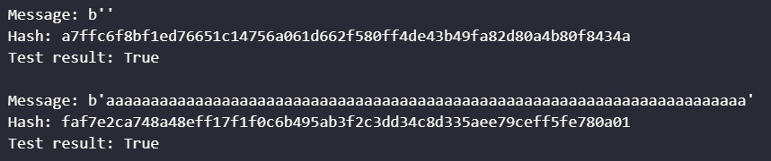
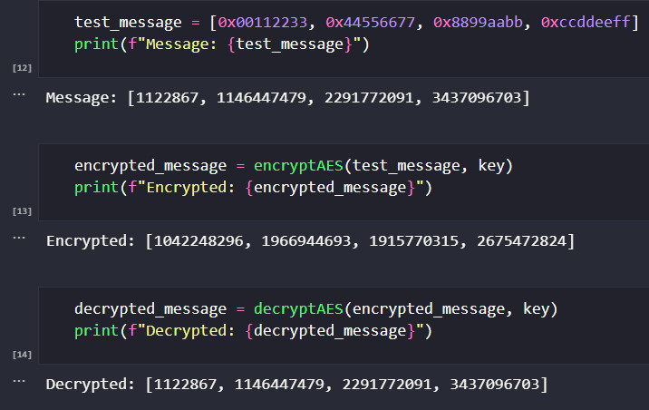
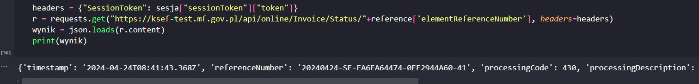
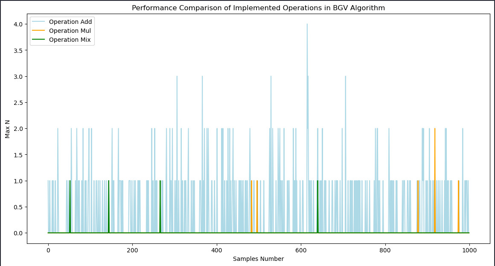

# Cryptography methods in Data Science 🔗
My projects made for the **Cryptography methods in Data Science** course at the AGH UST in 2024. All provided algorithms are from scratch as a result of my work after hours. Given tasks were intended to teach me how to apply mathematical solutions in Cryptography.

## <a href="https://github.com/bjam24/agh-cryptography-methods-in-data-science/blob/main/src/Cryptography_1.ipynb">Project 1 - SHA3-512</a>

## Project 2

## Project 3

## Project 4-5

## Technology stack
- Jupyter Notebook
- Python
